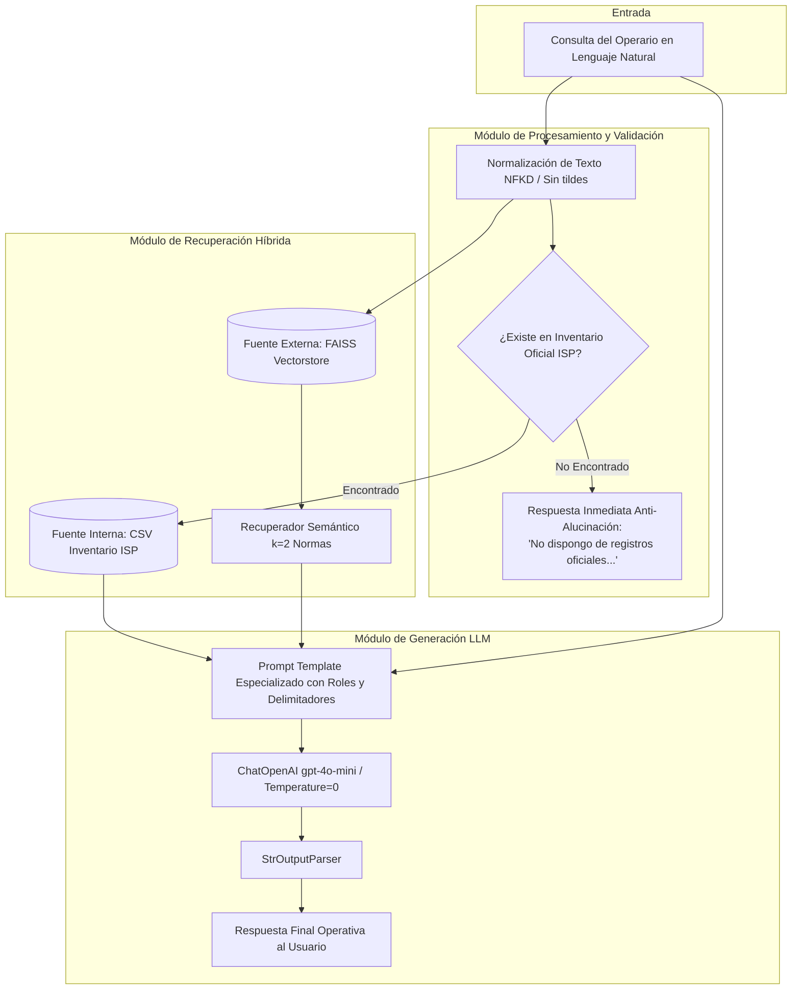

# Asistente Inteligente de Logística Farmacéutica con LLM y RAG

> **Asignatura:** ISY0101 - Ingeniería de Soluciones con IA  
> **Evaluación:** Evaluación Parcial N°1 — Diseño de Solución con LLM y RAG  
> **Organización:** MedisChil S.A. (Distribuidora y Bodega Farmacéutica)  
> **Caso de Estudio:** Gestión de Almacenamiento, Trazabilidad y Despacho de Productos Farmacéuticos Oficiales (Registro ISP Chile)

---

## 1. Descripción del Caso Organizacional (IE1)

### 1.1 Contexto de la Organización
**MedisChil S.A.** es una distribuidora y centro logístico farmacéutico de tamaño mediano que centraliza el almacenamiento y despacho de productos farmacéuticos hacia farmacias, hospitales y consultorios. Su catálogo supera los 2.400 registros vigentes autorizados por el Instituto de Salud Pública de Chile (ISP).

### 1.2 Identificación y Descripción del Problema
En las bodegas farmacéuticas, el personal operativo comete errores críticos por desconocimiento de las condiciones técnicas de manipulación (rotura de cadena de frío entre 2°C y 8°C, exposición solar o almacenamiento indebido de tópicos a más de 25°C). Además, consultar registros manuales en planillas o sistemas estáticos toma tiempo y no previene la confusión de nombres de fantasía o números de registro sanitario.

### 1.3 Objetivos de la Intervención
- **Objetivo General:** Implementar un asistente inteligente basado en LLM y Recuperación Aumentada (RAG) que responda consultas operativas en lenguaje natural en menos de 3 segundos, garantizando un 100% de apego a la normativa sanitaria y catálogo oficial.
- **Objetivos Específicos (Medibles):**
  1. Integrar el catálogo oficial del ISP (2.428 registros) como fuente de verdad interna.
  2. Implementar una base vectorial semántica (FAISS) con las normas técnicas de almacenamiento y despacho.
  3. Erradicar en un 100% las alucinaciones del modelo mediante un mecanismo de validación previa (*guardrail/short-circuit*) para productos fuera de inventario.

---

## 2. Fuentes de Datos (IE3)

| Tipo de Fuente | Origen / Formato | Rol en el Sistema |
| :--- | :--- | :--- |
| **Fuente Interna (Estructurada)** | `Productos_farmaceuticos_vigentes_venta_directa.csv` (2.428 registros del ISP, codificación UTF-8 / Latin-1) | Provee N° Registro Sanitario, Nombre Oficial del Producto, Razón Social Titular y Condición de Venta. |
| **Fuente Externa (No Estructurada)** | Manual Operativo de Bodega (Normas técnicas de vacunas/cadena de frío, ungüentos tópicos y protocolos de despacho) | Indexado semánticamente en base vectorial FAISS con embeddings de OpenAI (`text-embedding-3-small`). |

---

## 3. Arquitectura de la Solución (IE4, IE7)

El sistema combina módulos de **recuperación híbrida**, **procesamiento y validación previa**, y **generación aumentada** mediante LangChain Expression Language (LCEL).

### 3.1 Diagrama de Arquitectura



### 3.2 Componentes Clave:
1. **Recuperación Interna (Pandas):** Busca coincidencias exactas o por tokens significativos del registro sanitario o nombre comercial, descartando palabras vacías (*stopwords*).
2. **Short-Circuit Anti-Alucinación:** Si el producto no existe en el catálogo oficial de la bodega, la consulta **no llega al LLM**, retornando el mensaje de rechazo estricto. Esto ahorra tokens y anula alucinaciones de productos inexistentes.
3. **Recuperación Externa (FAISS Vectorstore):** Recupera las $k=2$ normas técnicas más afines para permitir cruces de condiciones (ej. temperatura de almacenamiento + inspección en despacho de venta directa).
4. **Generación LCEL:** Encadena `{contexto_inventario, contexto_manual, pregunta} | template_sistema | ChatOpenAI | StrOutputParser` de forma determinista (`temperature=0`).

---

## 4. Diseño y Formulación de Prompts (IE2)

El prompt está optimizado para garantizar trazabilidad y consistencia técnica:

- **Asignación de Rol:** *"Eres el Asistente Experto en Logística Farmacéutica de la bodega de MedisChil S.A."*
- **Delimitación de Contexto:** Se utilizan separadores explícitos para diferenciar los datos internos del inventario y las normas externas del manual.
- **Restricción Negativa (Negative Prompting):** Se fuerza al modelo a negarse a responder si el contexto no contiene la información oficial, reduciendo el riesgo operacional a cero.
- **Temperatura:** Fijada en `0.0` para respuestas estrictamente reproducibles y sin variabilidad creativa.

---

## 5. Instrucciones de Instalación y Ejecución

### Prerrequisitos
- Python 3.10 o superior (recomendado Python 3.11 o 3.12).
- Clave de API de OpenAI (`OPENAI_API_KEY`).

### Paso 1: Clonar el repositorio
```bash
git clone https://github.com/LarviNa/collab_farmacia.git
cd collab_farmacia
```

### Paso 2: Crear y activar entorno virtual
En Windows (PowerShell):
```powershell
python -m venv .venv
.\.venv\Scripts\Activate.ps1
```

En Linux / macOS:
```bash
python3 -m venv .venv
source .venv/bin/activate
```

### Paso 3: Instalar dependencias
```bash
pip install -r Requisitos.txt
```

### Paso 4: Configurar variables de entorno
Crea un archivo `.env` en la raíz del proyecto basándote en `.env.example`:
```env
OPENAI_API_KEY=tu_clave_de_openai_aqui
```

### Paso 5: Ejecutar la solución
```bash
python Solucion.py
```

---

## 6. Evidencia de Pruebas de Software (IE6)

El script incluye un banco de pruebas automáticas en su bloque de ejecución principal:

### Caso 1: Consulta Válida Multicriterio (Vacuna INFLUVAC)
- **Consulta:** *"¿Cuál es el protocolo de almacenamiento y la condición de venta para la vacuna INFLUVAC?"*
- **Datos Recuperados:**
  - *Interno:* Registro ISP F-18451/19, titular ABBOTT LABORATORIES DE CHILE LTDA, Condición Venta Directa.
  - *Externo:* Norma Técnica 01 (Cadena de frío 2°C a 8°C, prohibido congelar) y Norma Técnica 03 (Venta directa, verificación de precios y protección contra humedad).
- **Resultado Esperado:** Respuesta concisa integrando ambas normativas y los datos oficiales.

### Caso 2: Intento de Consulta de Producto Inexistente (Anti-Alucinación)
- **Consulta:** *"¿Cuáles son los requisitos de almacenamiento y despacho para el producto inexistente FANTASMIN 500?"*
- **Resultado Esperado:** Activación del guardrail de validación previa:
  > *"No dispongo de registros oficiales en la bodega para responder a esta operación."*

### Caso 3: Consulta de Tópicos (Ungüento HIPOGLOS)
- **Consulta:** *"¿Cómo debe almacenarse y despacharse el ungüento HIPOGLOS?"*
- **Datos Recuperados:**
  - *Interno:* Registro de ungüento en base ISP.
  - *Externo:* Norma Técnica 02 (temperatura ambiente controlada $\le 25^\circ\text{C}$, estanterías secas, evitar sol) y Norma Técnica 03 (despacho).
- **Resultado Esperado:** Respuesta coherente y ajustada a la norma de tópicos.

---

## 7. Declaración Ética y Uso de IA

- **Uso de Herramientas de IA:** Se utilizaron modelos de lenguaje para apoyar la generación de esquemas de documentación y optimización sintáctica de código.
- **Autoría:** El diseño de la arquitectura, la integración del dataset del ISP, la lógica de validación previa y las decisiones técnicas de RAG fueron diseñadas y supervisadas por el equipo de desarrollo.
- **Citación:** En conformidad con las directrices de Integridad Académica de Duoc UC (https://bibliotecas.duoc.cl/ia).
